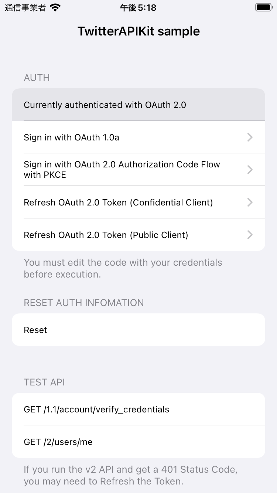

# TwitterAPIKit-iOS-sample

1. Open ViewController.swift and edit the credentials to yours.
2. Edit the URL of the OAuth1ThreeLeggedOAuthFlowViewController.swift or OAuth2CodeFlowPKCEViewController.swift callback to yours.

For more information, please visit https://github.com/mironal/TwitterAPIKit/blob/main/HowDoIAuthenticate.md

    

https://user-images.githubusercontent.com/537587/182564462-7df5c196-8f2a-47f1-82a8-d102103c2cef.mp4

